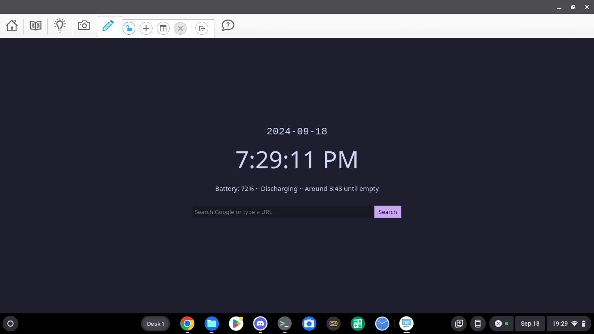

# webview-home
A home page that is designed with ChromeOS webviews in mind.\

## URL
https://kkilouwu.bio/home/

# Perks
## URL + Search bar
A handy URL+search bar so you can Google answers or quickly go to a website!
## Time and Date
A simple to read time and date so you don't have to leave the webview to look for it.
## Battery info
A simple battery percentage and time left counter to quickly determine how much battery is left.

# To do
- ~~actually work on the URL bar~~
- create a logo
- add a setting page to change search engine
- fix battery info not showing in some webviews (such as the lego webview (chrome app version))

# Explaination
ChromeOS webviews are often used to bypass internet censorship. Schools sometimes blocks websites that can be cruical to learning or to push their agenda, (example: schools blocking Wikipedia pages on guns), but webviews 90% of the time are limited to one tab with no URL bar. I created this to show time, date, and battery level along with a URL+Search bar for ease of access for people who have to use webviews.